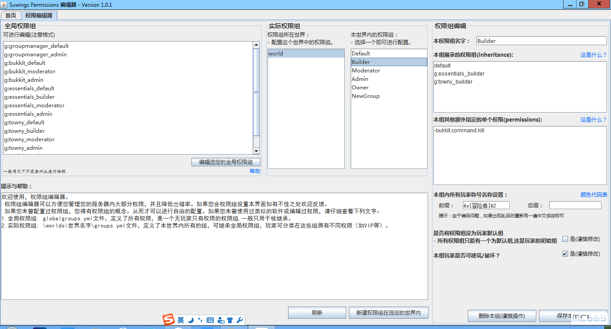

#欢迎使用SuwingsPermissions！
### 什么是SuwingsPermissions？
SuwingsPermissions是Minecraft Server GM插件的权限管理工具。

### SuwingsPermissions能完成什么任务？
SuwingsPermissions可以轻松并且一目了然的查看和管理你的Minecraft服务器的权限组。
### 关于二次发表的注意事项
如果你编程之后的产品打算进行第二次发表，请声明本GitHub链接处，并且遵循本程序使用的MIT开源协议。